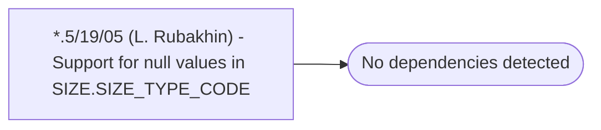

# *.5/19/05 (L. Rubakhin) - Support for null values in SIZE.SIZE_TYPE_CODE

**Database:** USICOAL  
**Server:** bedrockdb02  

## Architecture Diagram



## Table Dependencies

_No table references detected._

## Stored Procedure Code

```sql

```

