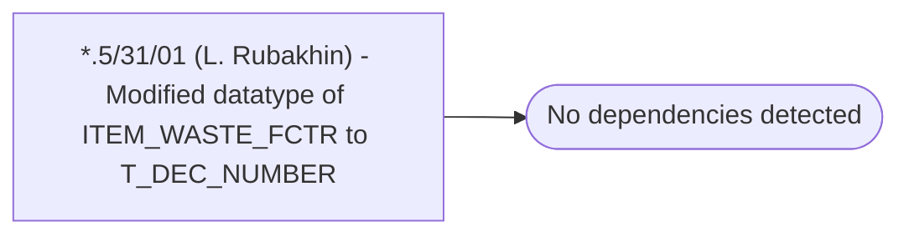

# *.5/31/01 (L. Rubakhin) - Modified datatype of ITEM_WASTE_FCTR to T_DEC_NUMBER

**Database:** USICOAL  
**Server:** bedrockdb02  

## Architecture Diagram



## Table Dependencies

_No table references detected._

## Stored Procedure Code

```sql

```

