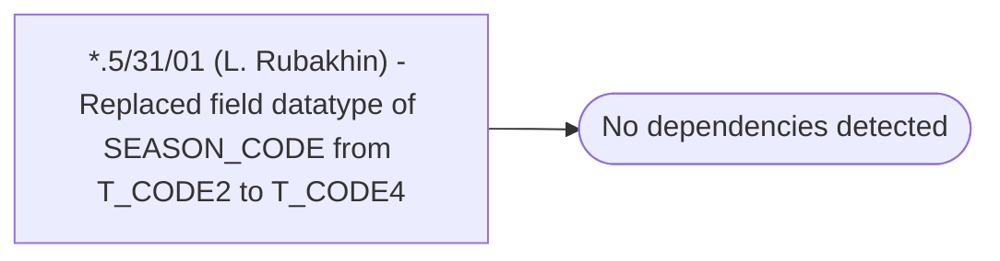

# *.5/31/01 (L. Rubakhin) - Replaced field datatype of SEASON_CODE from T_CODE2 to T_CODE4

**Database:** USICOAL  
**Server:** bedrockdb02  

## Architecture Diagram



## Table Dependencies

_No table references detected._

## Stored Procedure Code

```sql

```

