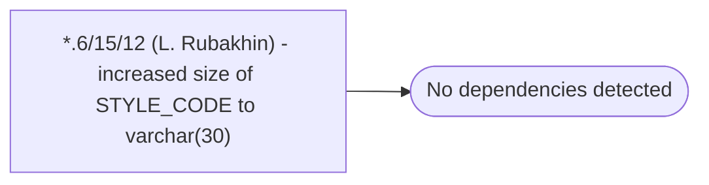

# *.6/15/12 (L. Rubakhin) - increased size of STYLE_CODE to varchar(30)

**Database:** USICOAL  
**Server:** bedrockdb02  

## Architecture Diagram



## Table Dependencies

_No table references detected._

## Stored Procedure Code

```sql

```

