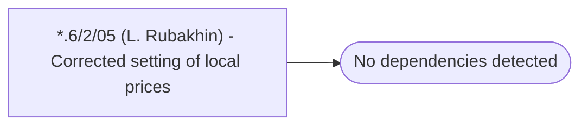

# *.6/2/05 (L. Rubakhin) - Corrected setting of local prices

**Database:** USICOAL  
**Server:** bedrockdb02  

## Architecture Diagram



## Table Dependencies

_No table references detected._

## Stored Procedure Code

```sql

```

