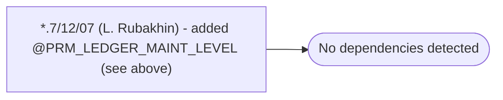

# *.7/12/07 (L. Rubakhin) - added @PRM_LEDGER_MAINT_LEVEL (see above)

**Database:** USICOAL  
**Server:** bedrockdb02  

## Architecture Diagram



## Table Dependencies

_No table references detected._

## Stored Procedure Code

```sql

```

