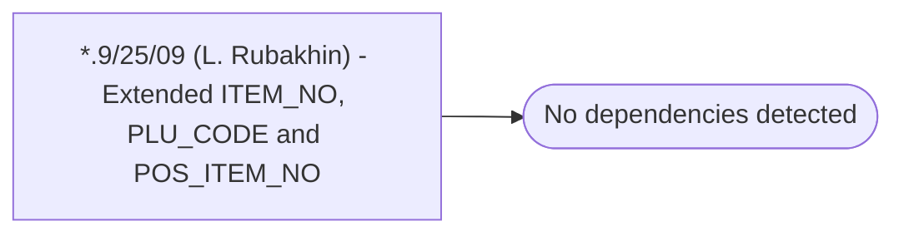

# *.9/25/09 (L. Rubakhin) - Extended ITEM_NO, PLU_CODE and POS_ITEM_NO

**Database:** USICOAL  
**Server:** bedrockdb02  

## Architecture Diagram



## Table Dependencies

_No table references detected._

## Stored Procedure Code

```sql

```

