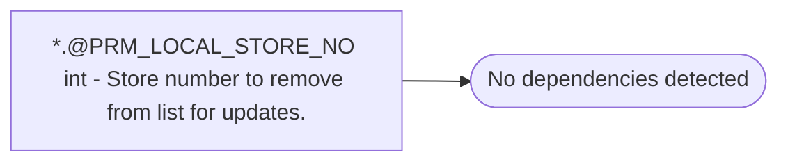

# *.@PRM_LOCAL_STORE_NO int - Store number to remove from list for updates.

**Database:** USICOAL  
**Server:** bedrockdb02  

## Architecture Diagram



## Table Dependencies

_No table references detected._

## Stored Procedure Code

```sql

```

