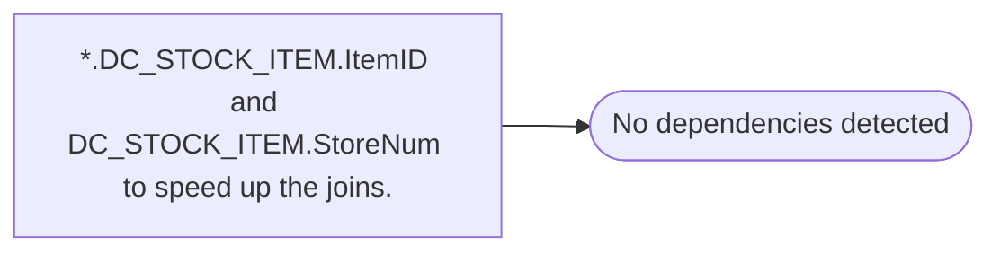

# *.DC_STOCK_ITEM.ItemID and DC_STOCK_ITEM.StoreNum to speed up the joins.

**Database:** USICOAL  
**Server:** bedrockdb02  

## Architecture Diagram



## Table Dependencies

_No table references detected._

## Stored Procedure Code

```sql

```

