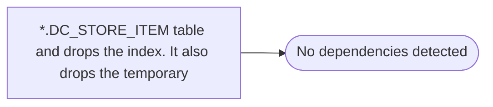

# *.DC_STORE_ITEM table and drops the index. It also drops the temporary

**Database:** USICOAL  
**Server:** bedrockdb02  

## Architecture Diagram



## Table Dependencies

_No table references detected._

## Stored Procedure Code

```sql

```

