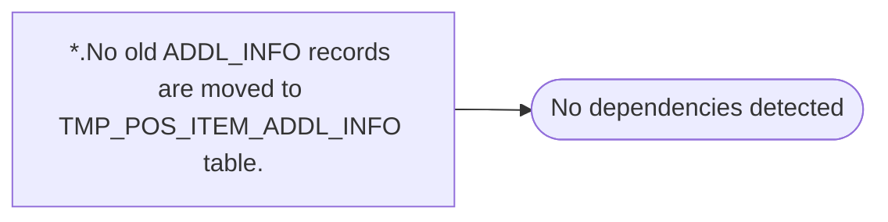

# *.No old ADDL_INFO records are moved to TMP_POS_ITEM_ADDL_INFO table.

**Database:** USICOAL  
**Server:** bedrockdb02  

## Architecture Diagram



## Table Dependencies

_No table references detected._

## Stored Procedure Code

```sql

```

