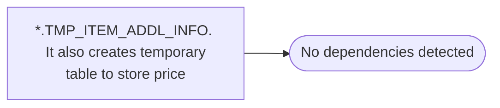

# *.TMP_ITEM_ADDL_INFO.  It also creates temporary table to store price

**Database:** USICOAL  
**Server:** bedrockdb02  

## Architecture Diagram



## Table Dependencies

_No table references detected._

## Stored Procedure Code

```sql

```

