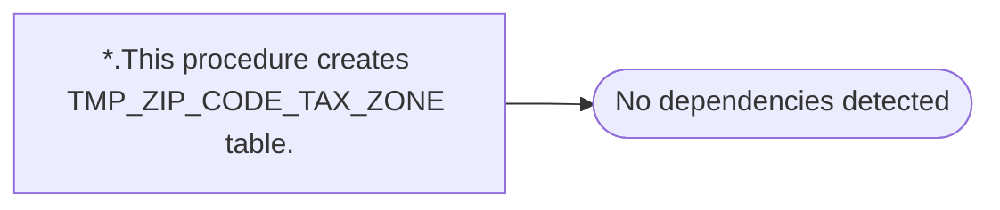

# *.This procedure creates TMP_ZIP_CODE_TAX_ZONE table.

**Database:** USICOAL  
**Server:** bedrockdb02  

## Architecture Diagram



## Table Dependencies

_No table references detected._

## Stored Procedure Code

```sql

```

