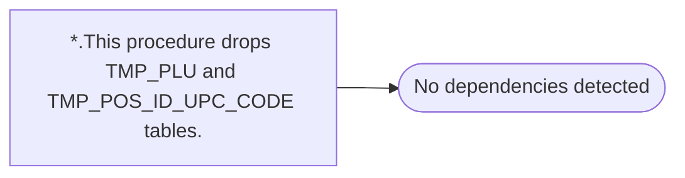

# *.This procedure drops TMP_PLU and TMP_POS_ID_UPC_CODE tables.

**Database:** USICOAL  
**Server:** bedrockdb02  

## Architecture Diagram



## Table Dependencies

_No table references detected._

## Stored Procedure Code

```sql

```

