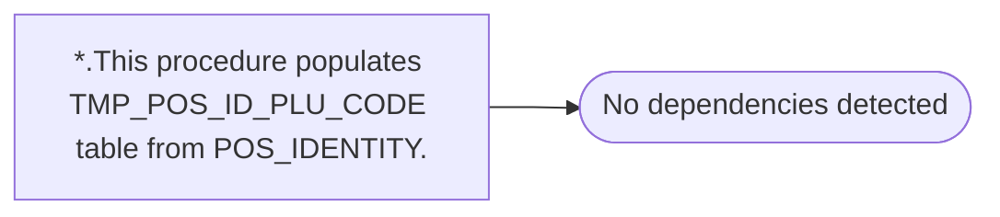

# *.This procedure populates TMP_POS_ID_PLU_CODE table from POS_IDENTITY.

**Database:** USICOAL  
**Server:** bedrockdb02  

## Architecture Diagram



## Table Dependencies

_No table references detected._

## Stored Procedure Code

```sql

```

