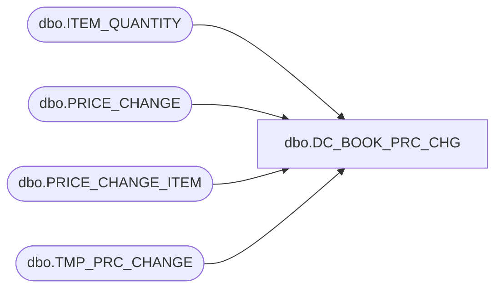

# dbo.DC_BOOK_PRC_CHG

**Database:** USICOAL  
**Server:** bedrockdb02  

## Architecture Diagram



## Table Dependencies

| Referenced Table |
|---|
| dbo.ITEM_QUANTITY |
| dbo.PRICE_CHANGE |
| dbo.PRICE_CHANGE_ITEM |
| dbo.TMP_PRC_CHANGE |

## Stored Procedure Code

```sql

```

