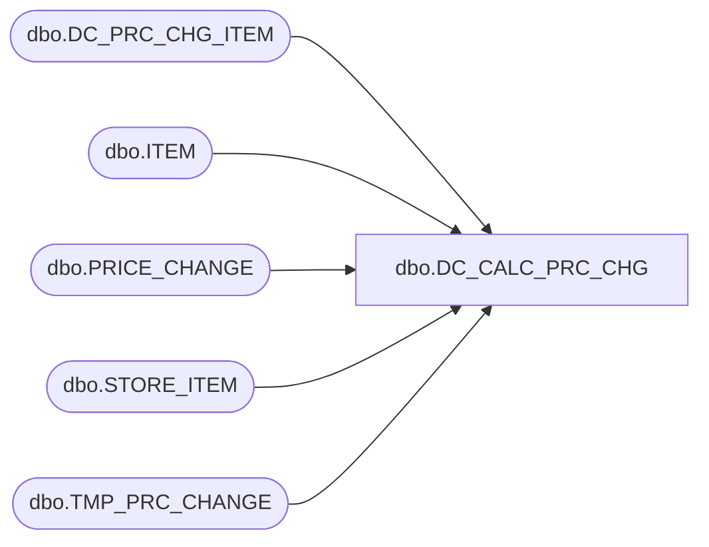

# dbo.DC_CALC_PRC_CHG

**Database:** USICOAL  
**Server:** bedrockdb02  

## Architecture Diagram



## Table Dependencies

| Referenced Table |
|---|
| dbo.DC_PRC_CHG_ITEM |
| dbo.ITEM |
| dbo.PRICE_CHANGE |
| dbo.STORE_ITEM |
| dbo.TMP_PRC_CHANGE |

## Stored Procedure Code

```sql

```

