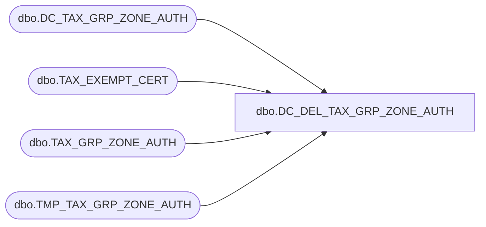

# dbo.DC_DEL_TAX_GRP_ZONE_AUTH

**Database:** USICOAL  
**Server:** bedrockdb02  

## Architecture Diagram



## Table Dependencies

| Referenced Table |
|---|
| dbo.DC_TAX_GRP_ZONE_AUTH |
| dbo.TAX_EXEMPT_CERT |
| dbo.TAX_GRP_ZONE_AUTH |
| dbo.TMP_TAX_GRP_ZONE_AUTH |

## Stored Procedure Code

```sql

```

