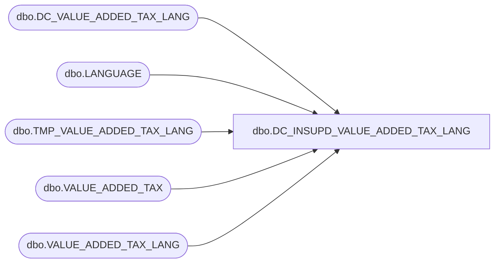

# dbo.DC_INSUPD_VALUE_ADDED_TAX_LANG

**Database:** USICOAL  
**Server:** bedrockdb02  

## Architecture Diagram



## Table Dependencies

| Referenced Table |
|---|
| dbo.DC_VALUE_ADDED_TAX_LANG |
| dbo.LANGUAGE |
| dbo.TMP_VALUE_ADDED_TAX_LANG |
| dbo.VALUE_ADDED_TAX |
| dbo.VALUE_ADDED_TAX_LANG |

## Stored Procedure Code

```sql

```

