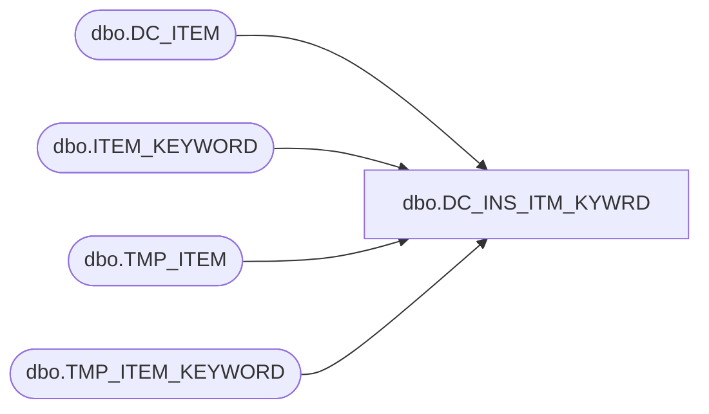

# dbo.DC_INS_ITM_KYWRD

**Database:** USICOAL  
**Server:** bedrockdb02  

## Architecture Diagram



## Table Dependencies

| Referenced Table |
|---|
| dbo.DC_ITEM |
| dbo.ITEM_KEYWORD |
| dbo.TMP_ITEM |
| dbo.TMP_ITEM_KEYWORD |

## Stored Procedure Code

```sql

```

