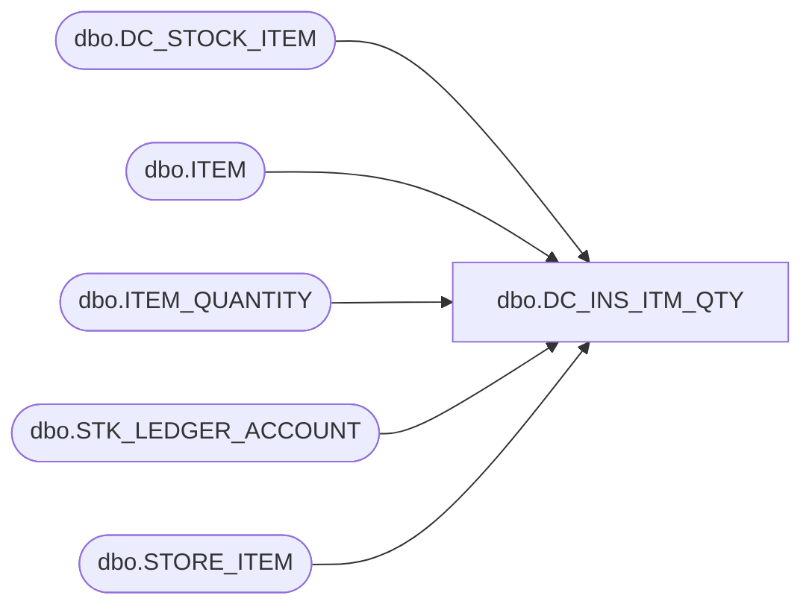

# dbo.DC_INS_ITM_QTY

**Database:** USICOAL  
**Server:** bedrockdb02  

## Architecture Diagram



## Table Dependencies

| Referenced Table |
|---|
| dbo.DC_STOCK_ITEM |
| dbo.ITEM |
| dbo.ITEM_QUANTITY |
| dbo.STK_LEDGER_ACCOUNT |
| dbo.STORE_ITEM |

## Stored Procedure Code

```sql

```

