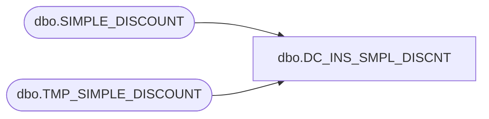

# dbo.DC_INS_SMPL_DISCNT

**Database:** USICOAL  
**Server:** bedrockdb02  

## Architecture Diagram



## Table Dependencies

| Referenced Table |
|---|
| dbo.SIMPLE_DISCOUNT |
| dbo.TMP_SIMPLE_DISCOUNT |

## Stored Procedure Code

```sql

```

