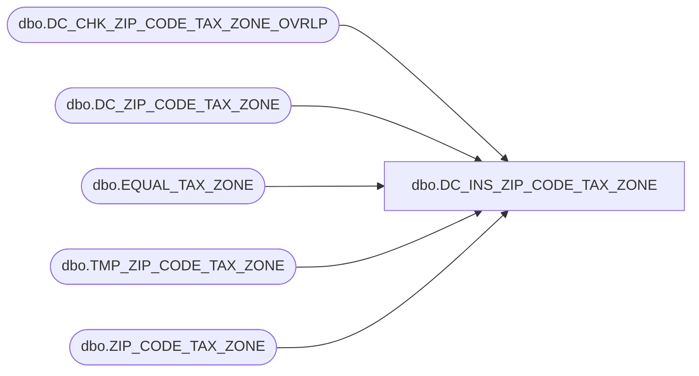

# dbo.DC_INS_ZIP_CODE_TAX_ZONE

**Database:** USICOAL  
**Server:** bedrockdb02  

## Architecture Diagram



## Table Dependencies

| Referenced Table |
|---|
| dbo.DC_CHK_ZIP_CODE_TAX_ZONE_OVRLP |
| dbo.DC_ZIP_CODE_TAX_ZONE |
| dbo.EQUAL_TAX_ZONE |
| dbo.TMP_ZIP_CODE_TAX_ZONE |
| dbo.ZIP_CODE_TAX_ZONE |

## Stored Procedure Code

```sql

```

