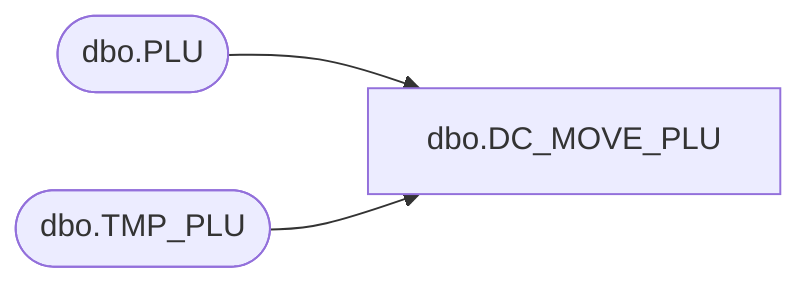

# dbo.DC_MOVE_PLU

**Database:** USICOAL  
**Server:** bedrockdb02  

## Architecture Diagram



## Table Dependencies

| Referenced Table |
|---|
| dbo.PLU |
| dbo.TMP_PLU |

## Stored Procedure Code

```sql

```

