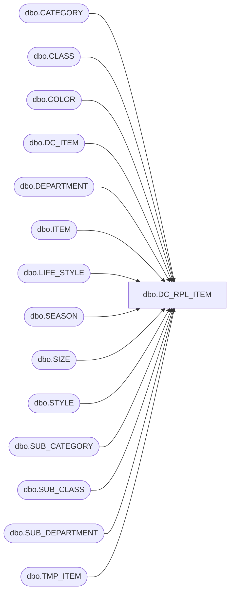

# dbo.DC_RPL_ITEM

**Database:** USICOAL  
**Server:** bedrockdb02  

## Architecture Diagram



## Table Dependencies

| Referenced Table |
|---|
| dbo.CATEGORY |
| dbo.CLASS |
| dbo.COLOR |
| dbo.DC_ITEM |
| dbo.DEPARTMENT |
| dbo.ITEM |
| dbo.LIFE_STYLE |
| dbo.SEASON |
| dbo.SIZE |
| dbo.STYLE |
| dbo.SUB_CATEGORY |
| dbo.SUB_CLASS |
| dbo.SUB_DEPARTMENT |
| dbo.TMP_ITEM |

## Stored Procedure Code

```sql

```

