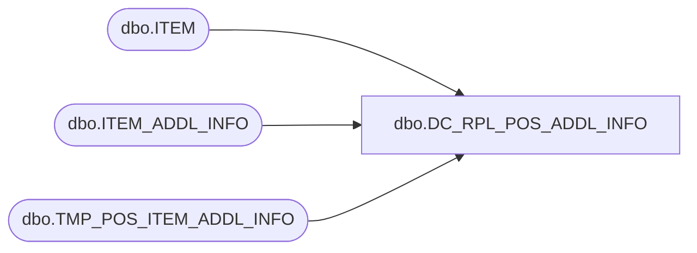

# dbo.DC_RPL_POS_ADDL_INFO

**Database:** USICOAL  
**Server:** bedrockdb02  

## Architecture Diagram



## Table Dependencies

| Referenced Table |
|---|
| dbo.ITEM |
| dbo.ITEM_ADDL_INFO |
| dbo.TMP_POS_ITEM_ADDL_INFO |

## Stored Procedure Code

```sql

```

