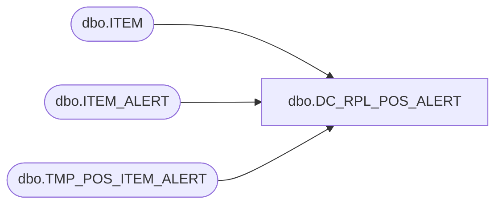

# dbo.DC_RPL_POS_ALERT

**Database:** USICOAL  
**Server:** bedrockdb02  

## Architecture Diagram



## Table Dependencies

| Referenced Table |
|---|
| dbo.ITEM |
| dbo.ITEM_ALERT |
| dbo.TMP_POS_ITEM_ALERT |

## Stored Procedure Code

```sql

```

