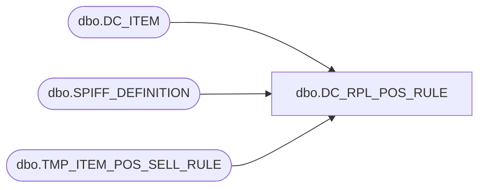

# dbo.DC_RPL_POS_RULE

**Database:** USICOAL  
**Server:** bedrockdb02  

## Architecture Diagram



## Table Dependencies

| Referenced Table |
|---|
| dbo.DC_ITEM |
| dbo.SPIFF_DEFINITION |
| dbo.TMP_ITEM_POS_SELL_RULE |

## Stored Procedure Code

```sql

```

