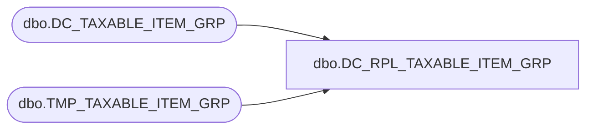

# dbo.DC_RPL_TAXABLE_ITEM_GRP

**Database:** USICOAL  
**Server:** bedrockdb02  

## Architecture Diagram



## Table Dependencies

| Referenced Table |
|---|
| dbo.DC_TAXABLE_ITEM_GRP |
| dbo.TMP_TAXABLE_ITEM_GRP |

## Stored Procedure Code

```sql

```

