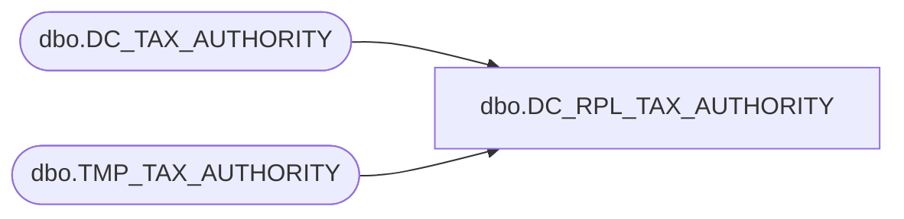

# dbo.DC_RPL_TAX_AUTHORITY

**Database:** USICOAL  
**Server:** bedrockdb02  

## Architecture Diagram



## Table Dependencies

| Referenced Table |
|---|
| dbo.DC_TAX_AUTHORITY |
| dbo.TMP_TAX_AUTHORITY |

## Stored Procedure Code

```sql

```

