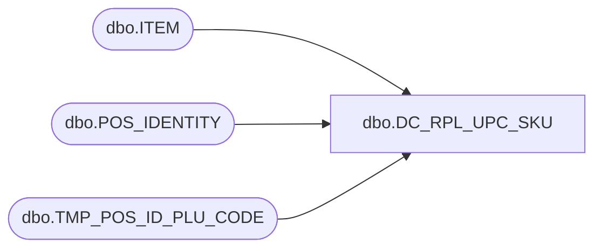

# dbo.DC_RPL_UPC_SKU

**Database:** USICOAL  
**Server:** bedrockdb02  

## Architecture Diagram



## Table Dependencies

| Referenced Table |
|---|
| dbo.ITEM |
| dbo.POS_IDENTITY |
| dbo.TMP_POS_ID_PLU_CODE |

## Stored Procedure Code

```sql

```

