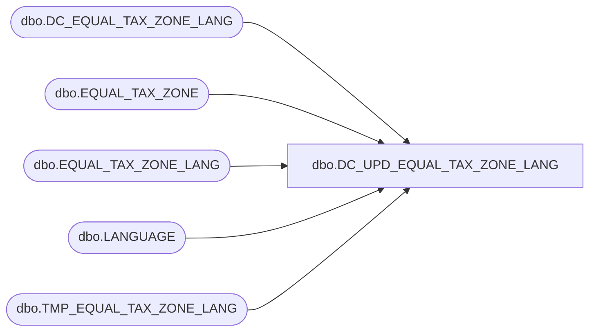

# dbo.DC_UPD_EQUAL_TAX_ZONE_LANG

**Database:** USICOAL  
**Server:** bedrockdb02  

## Architecture Diagram



## Table Dependencies

| Referenced Table |
|---|
| dbo.DC_EQUAL_TAX_ZONE_LANG |
| dbo.EQUAL_TAX_ZONE |
| dbo.EQUAL_TAX_ZONE_LANG |
| dbo.LANGUAGE |
| dbo.TMP_EQUAL_TAX_ZONE_LANG |

## Stored Procedure Code

```sql

```

