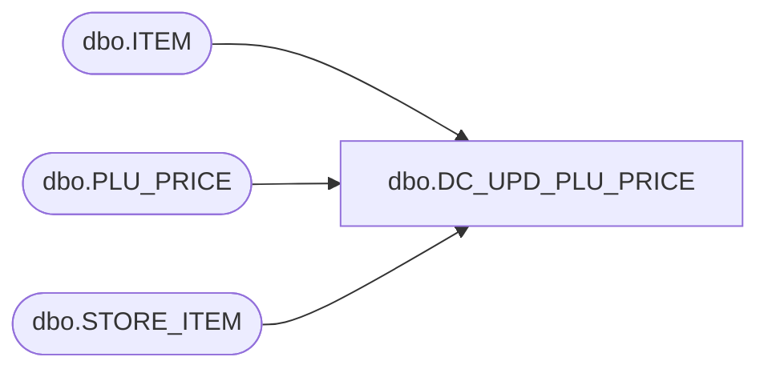

# dbo.DC_UPD_PLU_PRICE

**Database:** USICOAL  
**Server:** bedrockdb02  

## Architecture Diagram



## Table Dependencies

| Referenced Table |
|---|
| dbo.ITEM |
| dbo.PLU_PRICE |
| dbo.STORE_ITEM |

## Stored Procedure Code

```sql

```

