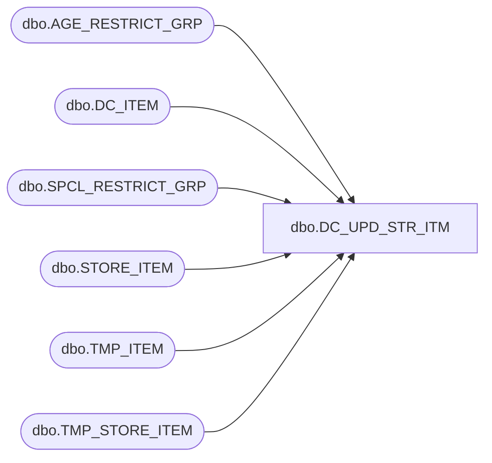

# dbo.DC_UPD_STR_ITM

**Database:** USICOAL  
**Server:** bedrockdb02  

## Architecture Diagram



## Table Dependencies

| Referenced Table |
|---|
| dbo.AGE_RESTRICT_GRP |
| dbo.DC_ITEM |
| dbo.SPCL_RESTRICT_GRP |
| dbo.STORE_ITEM |
| dbo.TMP_ITEM |
| dbo.TMP_STORE_ITEM |

## Stored Procedure Code

```sql

```

