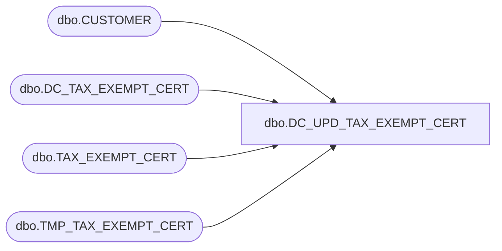

# dbo.DC_UPD_TAX_EXEMPT_CERT

**Database:** USICOAL  
**Server:** bedrockdb02  

## Architecture Diagram



## Table Dependencies

| Referenced Table |
|---|
| dbo.CUSTOMER |
| dbo.DC_TAX_EXEMPT_CERT |
| dbo.TAX_EXEMPT_CERT |
| dbo.TMP_TAX_EXEMPT_CERT |

## Stored Procedure Code

```sql

```

