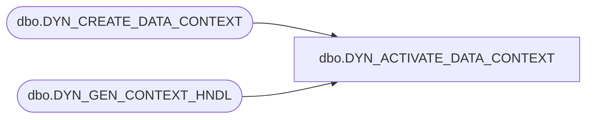

# dbo.DYN_ACTIVATE_DATA_CONTEXT

**Database:** USICOAL  
**Server:** bedrockdb02  

## Architecture Diagram



## Table Dependencies

| Referenced Table |
|---|
| dbo.DYN_CREATE_DATA_CONTEXT |
| dbo.DYN_GEN_CONTEXT_HNDL |

## Stored Procedure Code

```sql

```

