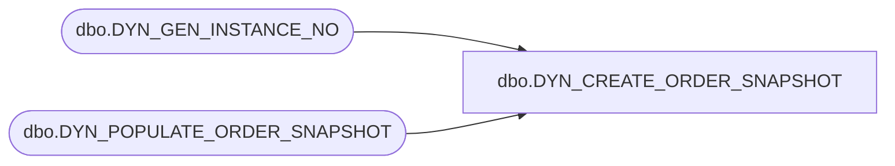

# dbo.DYN_CREATE_ORDER_SNAPSHOT

**Database:** USICOAL  
**Server:** bedrockdb02  

## Architecture Diagram



## Table Dependencies

| Referenced Table |
|---|
| dbo.DYN_GEN_INSTANCE_NO |
| dbo.DYN_POPULATE_ORDER_SNAPSHOT |

## Stored Procedure Code

```sql

```

