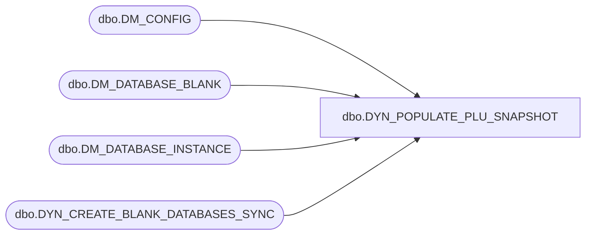

# dbo.DYN_POPULATE_PLU_SNAPSHOT

**Database:** USICOAL  
**Server:** bedrockdb02  

## Architecture Diagram



## Table Dependencies

| Referenced Table |
|---|
| dbo.DM_CONFIG |
| dbo.DM_DATABASE_BLANK |
| dbo.DM_DATABASE_INSTANCE |
| dbo.DYN_CREATE_BLANK_DATABASES_SYNC |

## Stored Procedure Code

```sql

```

