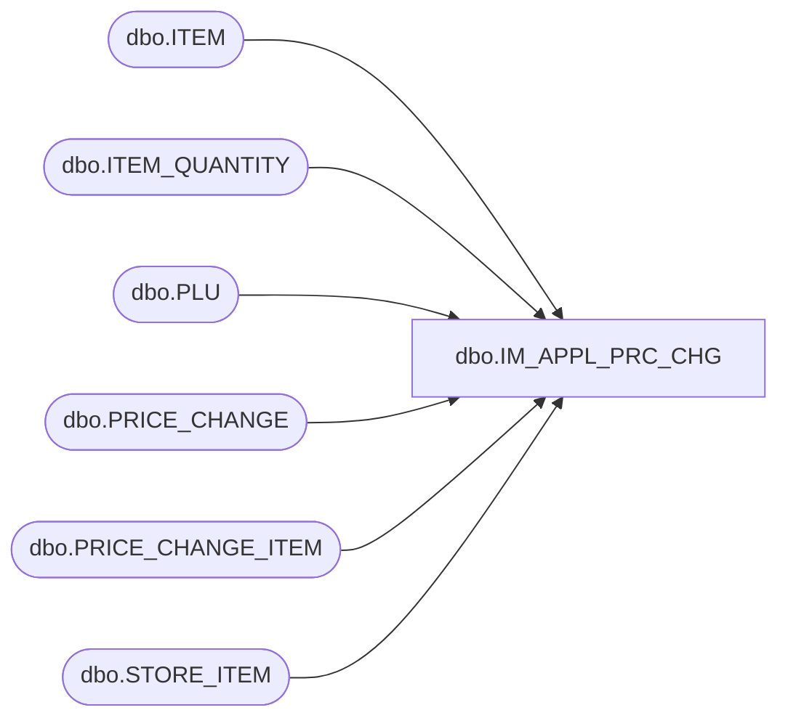

# dbo.IM_APPL_PRC_CHG

**Database:** USICOAL  
**Server:** bedrockdb02  

## Architecture Diagram



## Table Dependencies

| Referenced Table |
|---|
| dbo.ITEM |
| dbo.ITEM_QUANTITY |
| dbo.PLU |
| dbo.PRICE_CHANGE |
| dbo.PRICE_CHANGE_ITEM |
| dbo.STORE_ITEM |

## Stored Procedure Code

```sql

```

