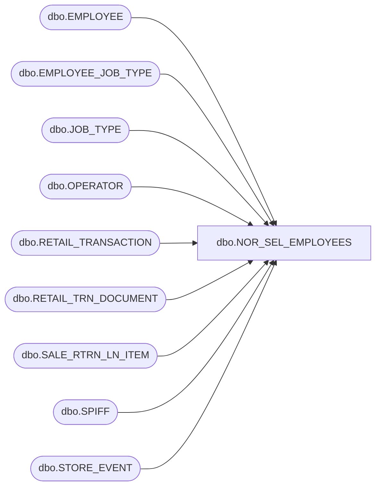

# dbo.NOR_SEL_EMPLOYEES

**Database:** USICOAL  
**Server:** bedrockdb02  

## Architecture Diagram



## Table Dependencies

| Referenced Table |
|---|
| dbo.EMPLOYEE |
| dbo.EMPLOYEE_JOB_TYPE |
| dbo.JOB_TYPE |
| dbo.OPERATOR |
| dbo.RETAIL_TRANSACTION |
| dbo.RETAIL_TRN_DOCUMENT |
| dbo.SALE_RTRN_LN_ITEM |
| dbo.SPIFF |
| dbo.STORE_EVENT |

## Stored Procedure Code

```sql

```

