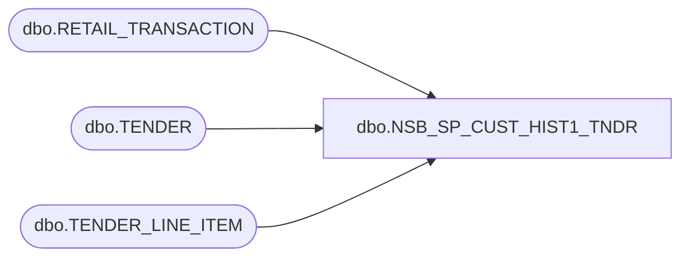

# dbo.NSB_SP_CUST_HIST1_TNDR

**Database:** USICOAL  
**Server:** bedrockdb02  

## Architecture Diagram



## Table Dependencies

| Referenced Table |
|---|
| dbo.RETAIL_TRANSACTION |
| dbo.TENDER |
| dbo.TENDER_LINE_ITEM |

## Stored Procedure Code

```sql
/* Report Id = 1030*/
```

