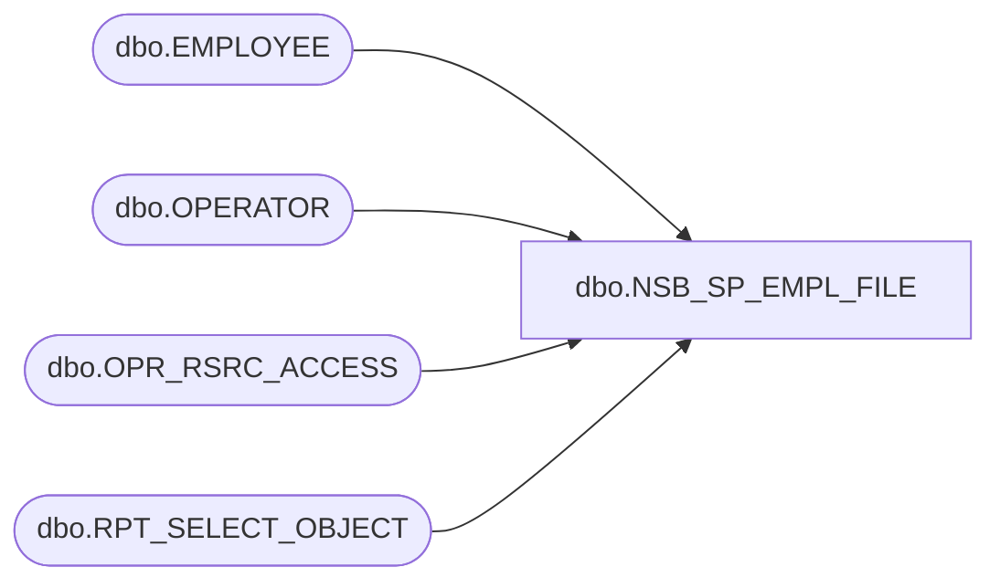

# dbo.NSB_SP_EMPL_FILE

**Database:** USICOAL  
**Server:** bedrockdb02  

## Architecture Diagram



## Table Dependencies

| Referenced Table |
|---|
| dbo.EMPLOYEE |
| dbo.OPERATOR |
| dbo.OPR_RSRC_ACCESS |
| dbo.RPT_SELECT_OBJECT |

## Stored Procedure Code

```sql
/*Report Id = 1010 */
```

