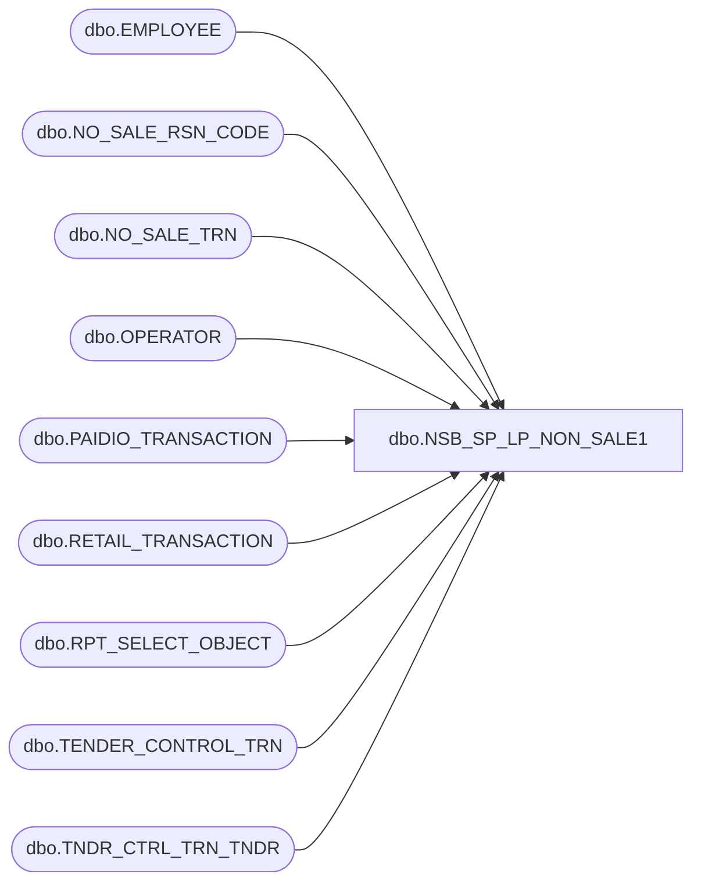

# dbo.NSB_SP_LP_NON_SALE1

**Database:** USICOAL  
**Server:** bedrockdb02  

## Architecture Diagram



## Table Dependencies

| Referenced Table |
|---|
| dbo.EMPLOYEE |
| dbo.NO_SALE_RSN_CODE |
| dbo.NO_SALE_TRN |
| dbo.OPERATOR |
| dbo.PAIDIO_TRANSACTION |
| dbo.RETAIL_TRANSACTION |
| dbo.RPT_SELECT_OBJECT |
| dbo.TENDER_CONTROL_TRN |
| dbo.TNDR_CTRL_TRN_TNDR |

## Stored Procedure Code

```sql

```

