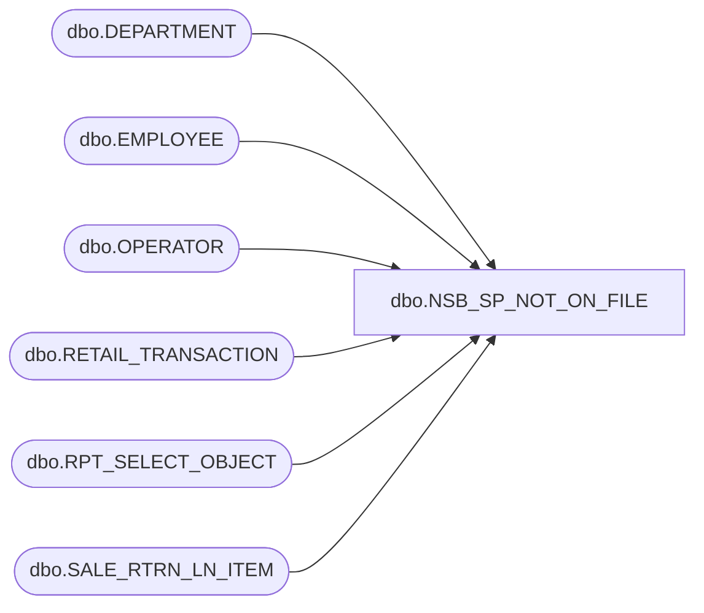

# dbo.NSB_SP_NOT_ON_FILE

**Database:** USICOAL  
**Server:** bedrockdb02  

## Architecture Diagram



## Table Dependencies

| Referenced Table |
|---|
| dbo.DEPARTMENT |
| dbo.EMPLOYEE |
| dbo.OPERATOR |
| dbo.RETAIL_TRANSACTION |
| dbo.RPT_SELECT_OBJECT |
| dbo.SALE_RTRN_LN_ITEM |

## Stored Procedure Code

```sql
/* Report Id = 1100
```

