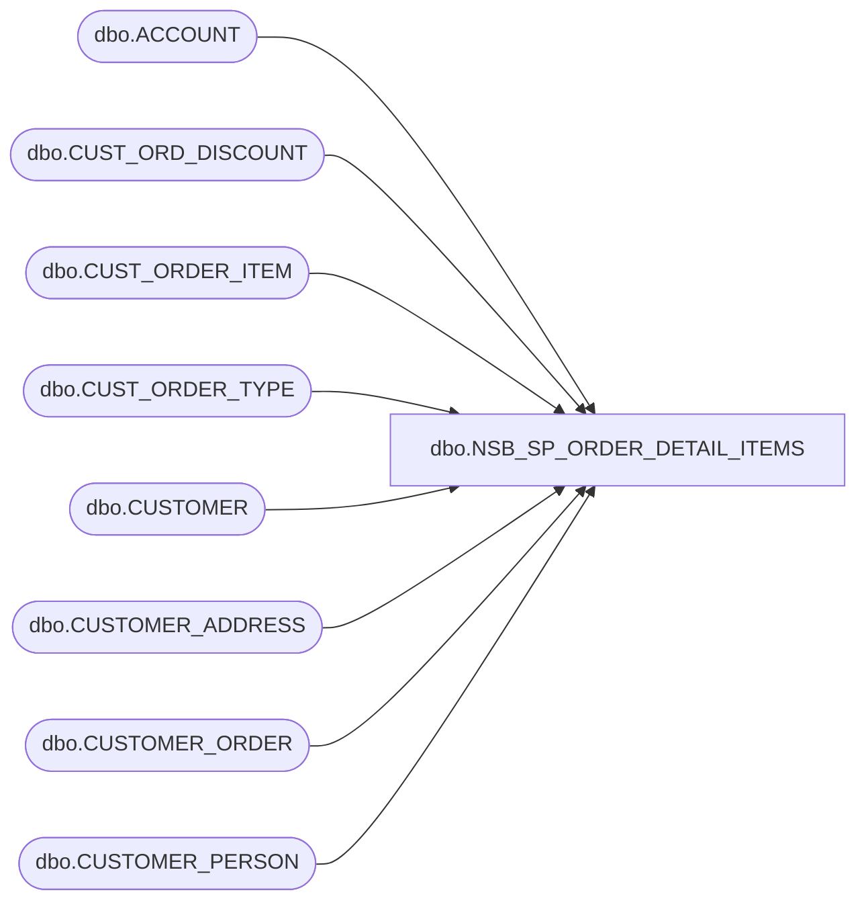

# dbo.NSB_SP_ORDER_DETAIL_ITEMS

**Database:** USICOAL  
**Server:** bedrockdb02  

## Architecture Diagram



## Table Dependencies

| Referenced Table |
|---|
| dbo.ACCOUNT |
| dbo.CUST_ORD_DISCOUNT |
| dbo.CUST_ORDER_ITEM |
| dbo.CUST_ORDER_TYPE |
| dbo.CUSTOMER |
| dbo.CUSTOMER_ADDRESS |
| dbo.CUSTOMER_ORDER |
| dbo.CUSTOMER_PERSON |

## Stored Procedure Code

```sql
/*report ID = 1401
```

