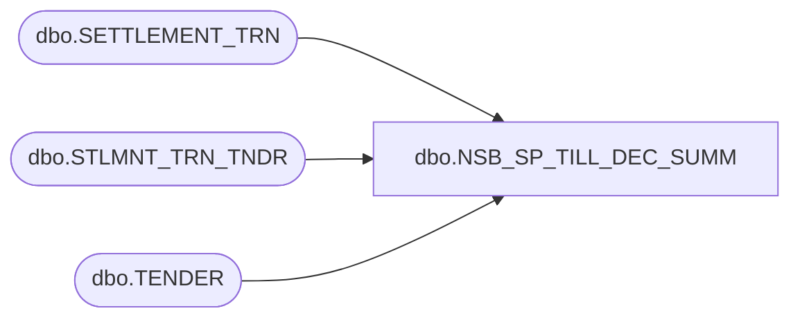

# dbo.NSB_SP_TILL_DEC_SUMM

**Database:** USICOAL  
**Server:** bedrockdb02  

## Architecture Diagram



## Table Dependencies

| Referenced Table |
|---|
| dbo.SETTLEMENT_TRN |
| dbo.STLMNT_TRN_TNDR |
| dbo.TENDER |

## Stored Procedure Code

```sql
/*Report Id = 1150*/
```

