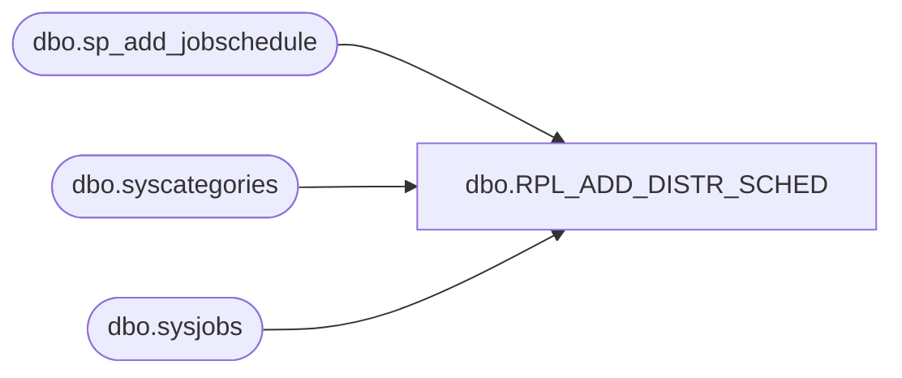

# dbo.RPL_ADD_DISTR_SCHED

**Database:** USICOAL  
**Server:** bedrockdb02  

## Architecture Diagram



## Table Dependencies

| Referenced Table |
|---|
| dbo.sp_add_jobschedule |
| dbo.syscategories |
| dbo.sysjobs |

## Stored Procedure Code

```sql

```

