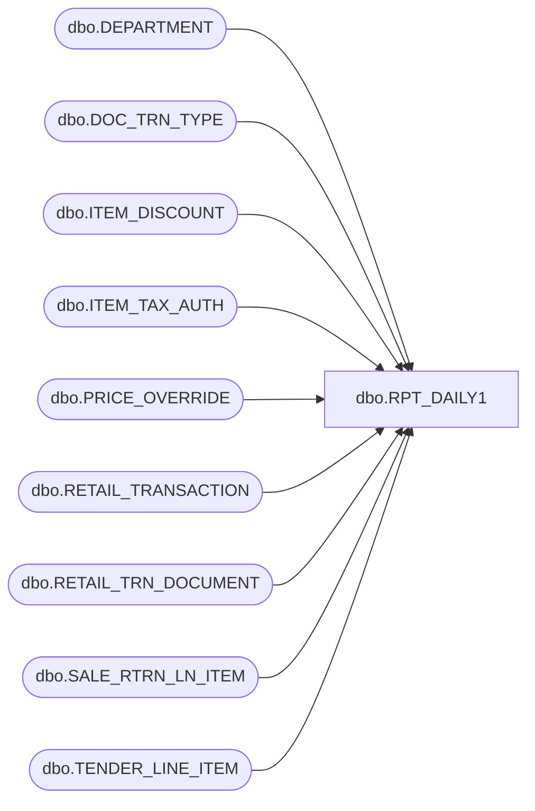

# dbo.RPT_DAILY1

**Database:** USICOAL  
**Server:** bedrockdb02  

## Architecture Diagram



## Table Dependencies

| Referenced Table |
|---|
| dbo.DEPARTMENT |
| dbo.DOC_TRN_TYPE |
| dbo.ITEM_DISCOUNT |
| dbo.ITEM_TAX_AUTH |
| dbo.PRICE_OVERRIDE |
| dbo.RETAIL_TRANSACTION |
| dbo.RETAIL_TRN_DOCUMENT |
| dbo.SALE_RTRN_LN_ITEM |
| dbo.TENDER_LINE_ITEM |

## Stored Procedure Code

```sql

```

