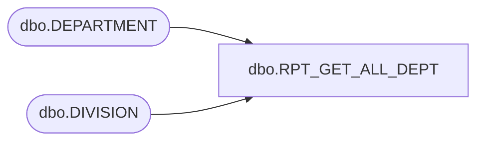

# dbo.RPT_GET_ALL_DEPT

**Database:** USICOAL  
**Server:** bedrockdb02  

## Architecture Diagram



## Table Dependencies

| Referenced Table |
|---|
| dbo.DEPARTMENT |
| dbo.DIVISION |

## Stored Procedure Code

```sql

```

