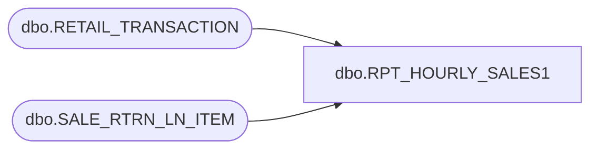

# dbo.RPT_HOURLY_SALES1

**Database:** USICOAL  
**Server:** bedrockdb02  

## Architecture Diagram



## Table Dependencies

| Referenced Table |
|---|
| dbo.RETAIL_TRANSACTION |
| dbo.SALE_RTRN_LN_ITEM |

## Stored Procedure Code

```sql

```

